# AI in Cyber Security Laboratory Manual

This lab manual contains the program question, dataset reference, complete Python code, terminal output, and generated image outputs for each weekly lab program.

## Dataset Files

- [auth.log](datasets/auth.log)
- [capture20110810.binetflow](datasets/capture20110810.binetflow)
- [dataset_full.csv](datasets/dataset_full.csv)
- [KDDTest+.txt](datasets/KDDTest+.txt)
- [KDDTrain+.txt](datasets/KDDTrain+.txt)
- [spam.csv](datasets/spam.csv)

## Program 1

### Lab Program Question

Write a program to preprocess and visualize cyber threat datasets to understand attack patterns and data characteristics.

### Dataset Link

- [KDDTrain+.txt](datasets/KDDTrain+.txt)

### Program Code

File: [`week1/p1.py`](week1/p1.py)

```python
# ============================================
# WEEK 1: DATA PREPROCESSING & VISUALIZATION
# (UPGRADED VERSION)
# ============================================

import pandas as pd
import numpy as np
import matplotlib.pyplot as plt
import seaborn as sns

from sklearn.preprocessing import LabelEncoder, MinMaxScaler
from mpl_toolkits.mplot3d import Axes3D


# ============================================
# LOAD DATASET
# ============================================

def load_dataset(filepath):

    columns = [
        'duration','protocol_type','service','flag','src_bytes','dst_bytes',
        'land','wrong_fragment','urgent','hot','num_failed_logins','logged_in',
        'num_compromised','root_shell','su_attempted','num_root','num_file_creations',
        'num_shells','num_access_files','num_outbound_cmds','is_host_login',
        'is_guest_login','count','srv_count','serror_rate','srv_serror_rate',
        'rerror_rate','srv_rerror_rate','same_srv_rate','diff_srv_rate',
        'srv_diff_host_rate','dst_host_count','dst_host_srv_count',
        'dst_host_same_srv_rate','dst_host_diff_srv_rate',
        'dst_host_same_src_port_rate','dst_host_srv_diff_host_rate',
        'dst_host_serror_rate','dst_host_srv_serror_rate',
        'dst_host_rerror_rate','dst_host_srv_rerror_rate','label','difficulty'
    ]

    df = pd.read_csv(filepath, names=columns)
    print("Dataset Loaded:", df.shape)

    return df


# ============================================
# CLEAN DATA
# ============================================

def clean_data(df):

    df = df.drop_duplicates()
    df = df.dropna()

    # Convert label to binary
    df['label'] = df['label'].apply(lambda x: 'Normal' if x == 'normal' else 'Attack')

    print("After Cleaning:", df.shape)

    return df


# ============================================
# ENCODE + SCALE (FOR FUTURE USE)
# ============================================

def encode_scale(df):

    df_encoded = df.copy()

    le = LabelEncoder()
    for col in ['protocol_type','service','flag']:
        df_encoded[col] = le.fit_transform(df_encoded[col])

    scaler = MinMaxScaler()
    num_cols = df_encoded.select_dtypes(include=np.number).columns
    df_encoded[num_cols] = scaler.fit_transform(df_encoded[num_cols])

    return df_encoded


# ============================================
# VISUALIZATION (RAW DATA ONLY)
# ============================================

def visualize(df):

    print("\nGenerating Visualizations...")

    # -------- 1. COUNT PLOT --------
    plt.figure(figsize=(6,4))
    sns.countplot(x='label', data=df)
    plt.title("Normal vs Attack Count")
    plt.show()


    # -------- 2. SCATTER (LOG SCALE) --------
    plt.figure(figsize=(6,4))
    plt.scatter(df['src_bytes'], df['dst_bytes'], alpha=0.5)
    plt.xscale('log')
    plt.yscale('log')
    plt.title("Scatter (Log Scale): src_bytes vs dst_bytes")
    plt.xlabel("src_bytes")
    plt.ylabel("dst_bytes")
    plt.show()


    # -------- 3. HEATMAP --------
    plt.figure(figsize=(12,8))
    numeric_df = df.select_dtypes(include=np.number)
    sns.heatmap(numeric_df.corr(), cmap='coolwarm')
    plt.title("Correlation Heatmap")
    plt.show()


    # -------- 4. BOXPLOT --------
    plt.figure(figsize=(6,4))
    sns.boxplot(x='label', y='src_bytes', data=df)
    plt.yscale('log')
    plt.title("Boxplot (Log Scale): src_bytes vs Label")
    plt.show()


    # -------- 5. 3D SCATTER --------
    sample = df.sample(3000)

    fig = plt.figure(figsize=(8,6))
    ax = fig.add_subplot(111, projection='3d')

    ax.scatter(sample['src_bytes'], sample['dst_bytes'], sample['count'],
               alpha=0.5)

    ax.set_xlabel("src_bytes")
    ax.set_ylabel("dst_bytes")
    ax.set_zlabel("count")
    plt.title("3D Scatter Plot")
    plt.show()


    


# ============================================
# MAIN
# ============================================

if __name__ == "__main__":

    # Load
    df = load_dataset("../datasets/KDDTrain+.txt")

    # Clean
    df = clean_data(df)

    # Keep RAW for visualization
    df_visual = df.copy()

    # Create scaled version (future weeks)
    df_scaled = encode_scale(df)

    # Visualize RAW data
    visualize(df_visual)

    print("\n✅ Week 1 Completed (Enhanced Visualization)")
```

### Output

Terminal output file: [`week1/result.txt`](week1/result.txt)

```text
Program: p1.py
Working directory: D:\Desktop\msc-lab\week1
Exit code: 0
========================================================================
Dataset Loaded: (125973, 43)
After Cleaning: (125973, 43)

Generating Visualizations...
[saved image] result_image_01.png
[saved image] result_image_02.png
[saved image] result_image_03.png
[saved image] result_image_04.png
[saved image] result_image_05.png

✅ Week 1 Completed (Enhanced Visualization)
```

### Output Images

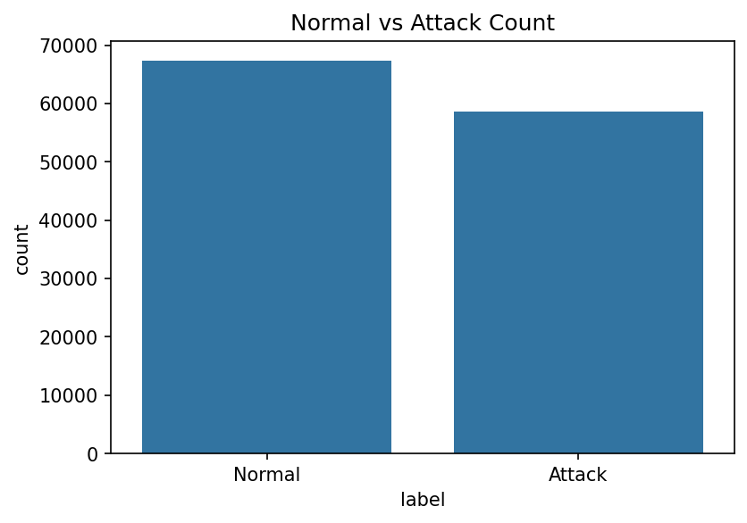

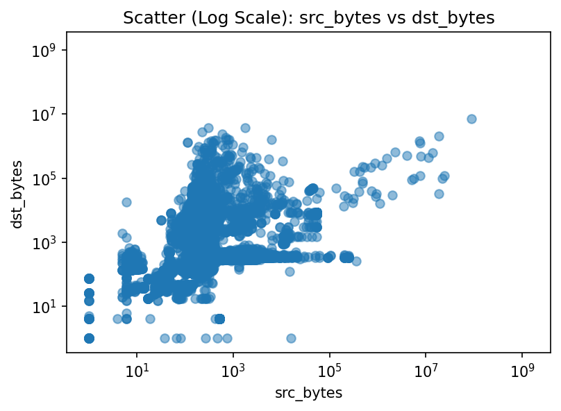

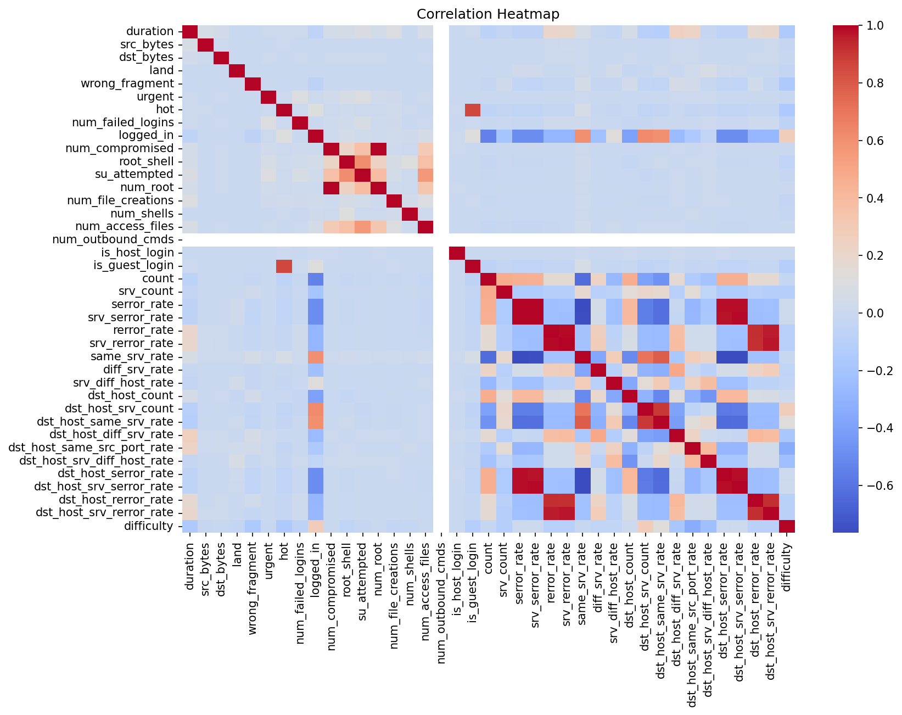

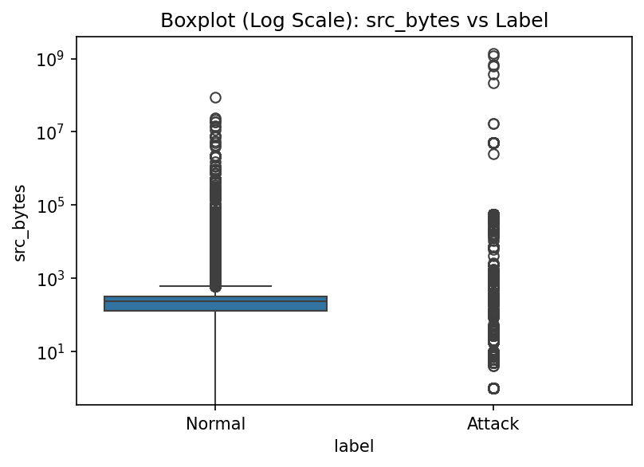

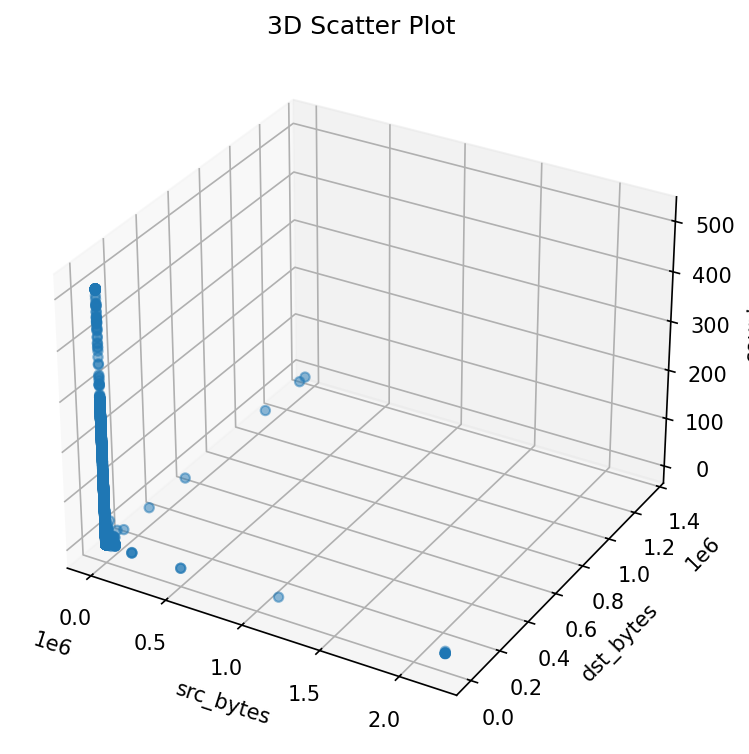

## Program 2

### Lab Program Question

Write a program to implement supervised classification for spam or phishing detection using algorithms such as Logistic Regression, Decision Trees, and Naive Bayes.

### Dataset Link

- [dataset_full.csv](datasets/dataset_full.csv)

### Program Code

File: [`week2/p2.py`](week2/p2.py)

```python
# ============================================
# WEEK 2: PHISHING DETECTION (FIXED VERSION)
# ============================================

import pandas as pd
import numpy as np

from sklearn.model_selection import train_test_split
from sklearn.preprocessing import StandardScaler

from sklearn.linear_model import LogisticRegression
from sklearn.tree import DecisionTreeClassifier
from sklearn.naive_bayes import GaussianNB

from sklearn.metrics import accuracy_score, confusion_matrix, classification_report
import seaborn as sns
import matplotlib.pyplot as plt


# ============================================
# LOAD DATA
# ============================================

def load_data(filepath):
    df = pd.read_csv(filepath)
    print("Dataset Loaded:", df.shape)
    return df


# ============================================
# PREPROCESS DATA
# ============================================

def preprocess(df):

    print("\nColumns:")
    print(df.columns)

    # Target column (based on your dataset)
    target = 'phishing'

    # Features and labels
    X = df.drop(columns=[target])
    y = df[target]

    # Convert to numeric (just in case)
    X = X.apply(pd.to_numeric, errors='coerce')

    # Handle missing values
    X = X.fillna(0)

    # Scale features
    scaler = StandardScaler()
    X_scaled = scaler.fit_transform(X)

    return X_scaled, y


# ============================================
# TRAIN MODELS
# ============================================

def train_models(X_train, y_train):

    models = {
        "Logistic Regression": LogisticRegression(max_iter=1000),
        "Decision Tree": DecisionTreeClassifier(),
        "Naive Bayes": GaussianNB()
    }

    trained_models = {}

    for name, model in models.items():
        model.fit(X_train, y_train)
        trained_models[name] = model

    return trained_models


# ============================================
# EVALUATE MODELS
# ============================================

def evaluate(models, X_test, y_test):

    for name, model in models.items():

        print(f"\n===== {name} =====")

        y_pred = model.predict(X_test)

        acc = accuracy_score(y_test, y_pred)
        print("Accuracy:", acc)

        print("\nClassification Report:")
        print(classification_report(y_test, y_pred))

        # Confusion Matrix
        cm = confusion_matrix(y_test, y_pred)

        plt.figure(figsize=(4,3))
        sns.heatmap(cm, annot=True, fmt='d', cmap='Blues')
        plt.title(f"{name} Confusion Matrix")
        plt.xlabel("Predicted")
        plt.ylabel("Actual")
        plt.show()


# ============================================
# MAIN
# ============================================

if __name__ == "__main__":

    # Load dataset
    df = load_data("../datasets/dataset_full.csv")

    # Preprocess
    X, y = preprocess(df)

    # Split data
    X_train, X_test, y_train, y_test = train_test_split(
        X, y, test_size=0.2, random_state=42
    )

    # Train models
    models = train_models(X_train, y_train)

    # Evaluate
    evaluate(models, X_test, y_test)

    print("\n✅ Week 2 Completed Successfully!")
```

### Output

Terminal output file: [`week2/result.txt`](week2/result.txt)

```text
Program: p2.py
Working directory: D:\Desktop\msc-lab\week2
Exit code: 0
========================================================================
Dataset Loaded: (88647, 112)

Columns:
Index(['qty_dot_url', 'qty_hyphen_url', 'qty_underline_url', 'qty_slash_url',
       'qty_questionmark_url', 'qty_equal_url', 'qty_at_url', 'qty_and_url',
       'qty_exclamation_url', 'qty_space_url',
       ...
       'qty_ip_resolved', 'qty_nameservers', 'qty_mx_servers', 'ttl_hostname',
       'tls_ssl_certificate', 'qty_redirects', 'url_google_index',
       'domain_google_index', 'url_shortened', 'phishing'],
      dtype='str', length=112)

===== Logistic Regression =====
Accuracy: 0.9328821206993796

Classification Report:
              precision    recall  f1-score   support

           0       0.95      0.94      0.95     11612
           1       0.89      0.91      0.90      6118

    accuracy                           0.93     17730
   macro avg       0.92      0.93      0.93     17730
weighted avg       0.93      0.93      0.93     17730

[saved image] result_image_01.png

===== Decision Tree =====
Accuracy: 0.9545967287084038

Classification Report:
              precision    recall  f1-score   support

           0       0.97      0.96      0.97     11612
           1       0.93      0.94      0.93      6118

    accuracy                           0.95     17730
   macro avg       0.95      0.95      0.95     17730
weighted avg       0.95      0.95      0.95     17730

[saved image] result_image_02.png

===== Naive Bayes =====
Accuracy: 0.7763113367174281

Classification Report:
              precision    recall  f1-score   support

           0       0.76      0.97      0.85     11612
           1       0.89      0.40      0.55      6118

    accuracy                           0.78     17730
   macro avg       0.82      0.69      0.70     17730
weighted avg       0.80      0.78      0.75     17730

[saved image] result_image_03.png

✅ Week 2 Completed Successfully!
```

### Output Images

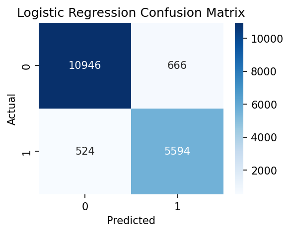

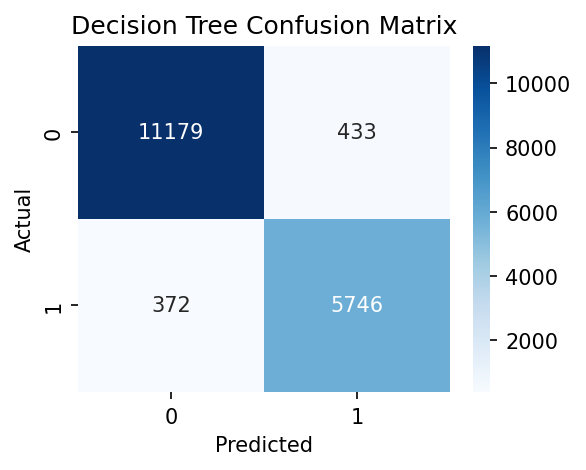

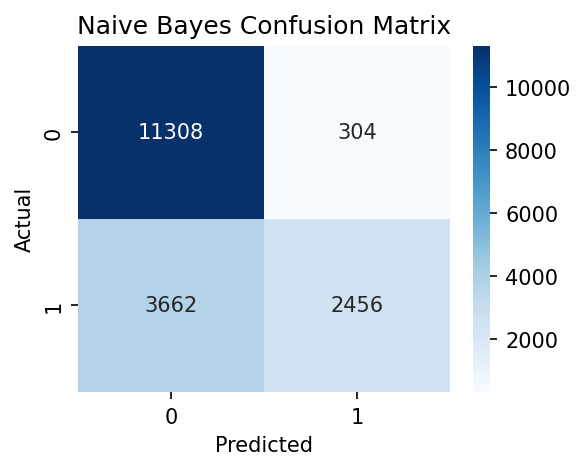

## Program 3

### Lab Program Question

Write a program to implement an anomaly detection system using unsupervised learning techniques for identifying network intrusions.

### Dataset Link

- [KDDTrain+.txt](datasets/KDDTrain+.txt)

### Program Code

File: [`week3/p3.py`](week3/p3.py)

```python
# ============================================
# WEEK 3: ANOMALY DETECTION (UNSUPERVISED)
# ============================================

import pandas as pd
import numpy as np

from sklearn.ensemble import IsolationForest
from sklearn.preprocessing import LabelEncoder, StandardScaler

import matplotlib.pyplot as plt


# ============================================
# LOAD DATA
# ============================================

def load_dataset(filepath):

    columns = [
        'duration','protocol_type','service','flag','src_bytes','dst_bytes',
        'land','wrong_fragment','urgent','hot','num_failed_logins','logged_in',
        'num_compromised','root_shell','su_attempted','num_root','num_file_creations',
        'num_shells','num_access_files','num_outbound_cmds','is_host_login',
        'is_guest_login','count','srv_count','serror_rate','srv_serror_rate',
        'rerror_rate','srv_rerror_rate','same_srv_rate','diff_srv_rate',
        'srv_diff_host_rate','dst_host_count','dst_host_srv_count',
        'dst_host_same_srv_rate','dst_host_diff_srv_rate',
        'dst_host_same_src_port_rate','dst_host_srv_diff_host_rate',
        'dst_host_serror_rate','dst_host_srv_serror_rate',
        'dst_host_rerror_rate','dst_host_srv_rerror_rate','label','difficulty'
    ]

    df = pd.read_csv(filepath, names=columns)
    print("Dataset Loaded:", df.shape)

    return df


# ============================================
# PREPROCESS
# ============================================

def preprocess(df):

    # Convert label for evaluation only
    df['label'] = df['label'].apply(lambda x: 0 if x == 'normal' else 1)

    # Encode categorical features
    le = LabelEncoder()
    for col in ['protocol_type', 'service', 'flag']:
        df[col] = le.fit_transform(df[col])

    # Drop label for UNSUPERVISED learning
    X = df.drop(columns=['label', 'difficulty'])

    # Scale features
    scaler = StandardScaler()
    X_scaled = scaler.fit_transform(X)

    return X_scaled, df['label']


# ============================================
# ANOMALY DETECTION
# ============================================

def detect_anomalies(X):

    # Isolation Forest model
    model = IsolationForest(contamination=0.1, random_state=42)

    model.fit(X)

    predictions = model.predict(X)   # 1 (normal), -1 (anomaly)

    return predictions


# ============================================
# EVALUATION
# ============================================

def evaluate(predictions, true_labels):

    # Convert predictions:
    # -1 → anomaly → 1
    # 1 → normal → 0
    pred = np.where(predictions == -1, 1, 0)

    print("\nDetected Anomalies:", np.sum(pred))

    # Compare with true labels
    accuracy = np.mean(pred == true_labels)
    print("Approx Accuracy:", accuracy)


# ============================================
# VISUALIZATION
# ============================================
def visualize(X, predictions):

    # Convert predictions
    normal = X[predictions == 1]
    anomaly = X[predictions == -1]

    plt.figure(figsize=(6,4))

    # Plot normal points
    plt.scatter(normal[:, 0], normal[:, 1],
                color='blue', label='Normal', alpha=0.5)

    # Plot anomalies
    plt.scatter(anomaly[:, 0], anomaly[:, 1],
                color='red', label='Anomaly', alpha=0.5)

    plt.title("Anomaly Detection Visualization")
    plt.xlabel("Feature 1")
    plt.ylabel("Feature 2")

    plt.legend()
    plt.show()


# ============================================
# MAIN
# ============================================

if __name__ == "__main__":

    df = load_dataset("../datasets/KDDTrain+.txt")

    X, y = preprocess(df)

    predictions = detect_anomalies(X)

    evaluate(predictions, y)

    visualize(X, predictions)

    print("\n✅ Week 3 Completed Successfully!")
```

### Output

Terminal output file: [`week3/result.txt`](week3/result.txt)

```text
Program: p3.py
Working directory: D:\Desktop\msc-lab\week3
Exit code: 0
========================================================================
Dataset Loaded: (125973, 43)

Detected Anomalies: 12598
Approx Accuracy: 0.5669071943987998
[saved image] result_image_01.png

✅ Week 3 Completed Successfully!
```

### Output Images

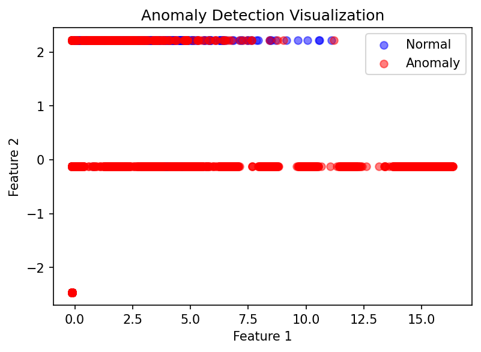

## Program 4

### Lab Program Question

Write a program to design and evaluate an Intrusion Detection System (IDS) using machine learning algorithms and performance metrics such as Accuracy, Precision, Recall, and F1-Score.

### Dataset Link

- [KDDTrain+.txt](datasets/KDDTrain+.txt)

### Program Code

File: [`week4/p4.py`](week4/p4.py)

```python
# ============================================
# WEEK 4: INTRUSION DETECTION SYSTEM (IDS)
# ============================================

import pandas as pd
import numpy as np

from sklearn.model_selection import train_test_split
from sklearn.preprocessing import LabelEncoder, StandardScaler

from sklearn.tree import DecisionTreeClassifier
from sklearn.metrics import accuracy_score, precision_score, recall_score, f1_score, confusion_matrix

import seaborn as sns
import matplotlib.pyplot as plt


# ============================================
# LOAD DATA
# ============================================

def load_dataset(filepath):

    columns = [
        'duration','protocol_type','service','flag','src_bytes','dst_bytes',
        'land','wrong_fragment','urgent','hot','num_failed_logins','logged_in',
        'num_compromised','root_shell','su_attempted','num_root','num_file_creations',
        'num_shells','num_access_files','num_outbound_cmds','is_host_login',
        'is_guest_login','count','srv_count','serror_rate','srv_serror_rate',
        'rerror_rate','srv_rerror_rate','same_srv_rate','diff_srv_rate',
        'srv_diff_host_rate','dst_host_count','dst_host_srv_count',
        'dst_host_same_srv_rate','dst_host_diff_srv_rate',
        'dst_host_same_src_port_rate','dst_host_srv_diff_host_rate',
        'dst_host_serror_rate','dst_host_srv_serror_rate',
        'dst_host_rerror_rate','dst_host_srv_rerror_rate','label','difficulty'
    ]

    df = pd.read_csv(filepath, names=columns)
    print("Dataset Loaded:", df.shape)

    return df


# ============================================
# PREPROCESS
# ============================================

def preprocess(df):

    # Convert label
    df['label'] = df['label'].apply(lambda x: 0 if x == 'normal' else 1)

    # Encode categorical features
    le = LabelEncoder()
    for col in ['protocol_type', 'service', 'flag']:
        df[col] = le.fit_transform(df[col])

    # Features & Target
    X = df.drop(columns=['label', 'difficulty'])
    y = df['label']

    # Scale data
    scaler = StandardScaler()
    X_scaled = scaler.fit_transform(X)

    return X_scaled, y


# ============================================
# TRAIN MODEL
# ============================================

def train_model(X_train, y_train):

    model = DecisionTreeClassifier()
    model.fit(X_train, y_train)

    return model


# ============================================
# EVALUATE
# ============================================

def evaluate(model, X_test, y_test):

    y_pred = model.predict(X_test)

    print("\nAccuracy:", accuracy_score(y_test, y_pred))
    print("Precision:", precision_score(y_test, y_pred))
    print("Recall:", recall_score(y_test, y_pred))
    print("F1 Score:", f1_score(y_test, y_pred))

    # Confusion Matrix
    cm = confusion_matrix(y_test, y_pred)

    plt.figure(figsize=(4,3))
    sns.heatmap(cm, annot=True, fmt='d', cmap='Blues')
    plt.title("Confusion Matrix")
    plt.xlabel("Predicted")
    plt.ylabel("Actual")
    plt.show()


# ============================================
# MAIN
# ============================================

if __name__ == "__main__":

    df = load_dataset("../datasets/KDDTrain+.txt")

    X, y = preprocess(df)

    X_train, X_test, y_train, y_test = train_test_split(
        X, y, test_size=0.2, random_state=42
    )

    model = train_model(X_train, y_train)

    evaluate(model, X_test, y_test)

    print("\n✅ Week 4 Completed Successfully!")
```

### Output

Terminal output file: [`week4/result.txt`](week4/result.txt)

```text
Program: p4.py
Working directory: D:\Desktop\msc-lab\week4
Exit code: 0
========================================================================
Dataset Loaded: (125973, 43)

Accuracy: 0.9980154792617583
Precision: 0.9982150446238844
Recall: 0.9975367366006965
F1 Score: 0.9978757753420001
[saved image] result_image_01.png

✅ Week 4 Completed Successfully!
```

### Output Images

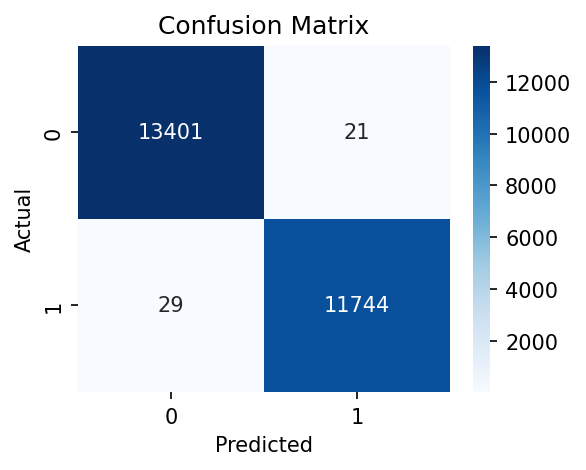

## Program 5

### Lab Program Question

Write a program to apply clustering algorithms such as K-Means and DBSCAN for detecting abnormal patterns and grouping malicious network traffic.

### Dataset Link

- [KDDTrain+.txt](datasets/KDDTrain+.txt)

### Program Code

File: [`week5/p5.py`](week5/p5.py)

```python
# ============================================
# WEEK 5: CLUSTERING (K-MEANS + DBSCAN)
# ============================================

import pandas as pd
import numpy as np

from sklearn.preprocessing import LabelEncoder, StandardScaler
from sklearn.cluster import KMeans, DBSCAN

import matplotlib.pyplot as plt


# ============================================
# LOAD DATA
# ============================================

def load_dataset(filepath):

    columns = [
        'duration','protocol_type','service','flag','src_bytes','dst_bytes',
        'land','wrong_fragment','urgent','hot','num_failed_logins','logged_in',
        'num_compromised','root_shell','su_attempted','num_root','num_file_creations',
        'num_shells','num_access_files','num_outbound_cmds','is_host_login',
        'is_guest_login','count','srv_count','serror_rate','srv_serror_rate',
        'rerror_rate','srv_rerror_rate','same_srv_rate','diff_srv_rate',
        'srv_diff_host_rate','dst_host_count','dst_host_srv_count',
        'dst_host_same_srv_rate','dst_host_diff_srv_rate',
        'dst_host_same_src_port_rate','dst_host_srv_diff_host_rate',
        'dst_host_serror_rate','dst_host_srv_serror_rate',
        'dst_host_rerror_rate','dst_host_srv_rerror_rate','label','difficulty'
    ]

    df = pd.read_csv(filepath, names=columns)
    print("Dataset Loaded:", df.shape)

    return df


# ============================================
# PREPROCESS
# ============================================

def preprocess(df):

    # Encode categorical features
    le = LabelEncoder()
    for col in ['protocol_type', 'service', 'flag']:
        df[col] = le.fit_transform(df[col])

    # Drop label (unsupervised)
    X = df.drop(columns=['label', 'difficulty'])

    # Scale data
    scaler = StandardScaler()
    X_scaled = scaler.fit_transform(X)

    return X_scaled


# ============================================
# K-MEANS
# ============================================

def apply_kmeans(X):

    kmeans = KMeans(n_clusters=2, random_state=42)
    labels = kmeans.fit_predict(X)

    print("\nK-Means Clustering Done!")
    return labels


# ============================================
# DBSCAN
# ============================================

def apply_dbscan(X):

    dbscan = DBSCAN(eps=2, min_samples=10)
    labels = dbscan.fit_predict(X)

    print("\nDBSCAN Clustering Done!")
    return labels


# ============================================
# VISUALIZATION
# ============================================
def visualize(X, labels, title):

    plt.figure(figsize=(10,6))  # bigger figure

    unique_labels = np.unique(labels)
    max_clusters = 5
    shown_labels = unique_labels[:max_clusters]

    for label in shown_labels:

        cluster_points = X[labels == label]

        # Noise handling
        if label == -1:
            plt.scatter(cluster_points[:, 0], cluster_points[:, 1],
                        label='Noise (Anomaly)',
                        alpha=0.6, s=10)
        else:
            plt.scatter(cluster_points[:, 0], cluster_points[:, 1],
                        label=f'Cluster {label}',
                        alpha=0.6, s=10)

    plt.title(title)
    plt.xlabel("Feature 1")
    plt.ylabel("Feature 2")

    # 🔥 Move legend outside
    plt.legend(bbox_to_anchor=(1.05, 1), loc='upper left')

    # Adjust layout so graph doesn't shrink
    plt.tight_layout()

    plt.show()
# ============================================
# MAIN
# ============================================

if __name__ == "__main__":

    df = load_dataset("../datasets/KDDTrain+.txt")

    X = preprocess(df)
    X_sample = X[:10000]   # or 3000 if needed

    # K-Means
    kmeans_labels = apply_kmeans(X)
    visualize(X, kmeans_labels, "K-Means Clustering")

    # DBSCAN
    dbscan_labels = apply_dbscan(X_sample)
    visualize(X_sample, dbscan_labels, "DBSCAN Clustering")

    print("\n✅ Week 5 Completed Successfully!")
```

### Output

Terminal output file: [`week5/result.txt`](week5/result.txt)

```text
Program: p5.py
Working directory: D:\Desktop\msc-lab\week5
Exit code: 0
========================================================================
Dataset Loaded: (125973, 43)
D:\Desktop\msc-lab\cyber_env\Lib\site-packages\joblib\externals\loky\backend\context.py:131: UserWarning: Could not find the number of physical cores for the following reason:
found 0 physical cores < 1
Returning the number of logical cores instead. You can silence this warning by setting LOKY_MAX_CPU_COUNT to the number of cores you want to use.
  warnings.warn(
  File "D:\Desktop\msc-lab\cyber_env\Lib\site-packages\joblib\externals\loky\backend\context.py", line 255, in _count_physical_cores
    raise ValueError(f"found {cpu_count_physical} physical cores < 1")

K-Means Clustering Done!
[saved image] result_image_01.png

DBSCAN Clustering Done!
[saved image] result_image_02.png

✅ Week 5 Completed Successfully!
```

### Output Images

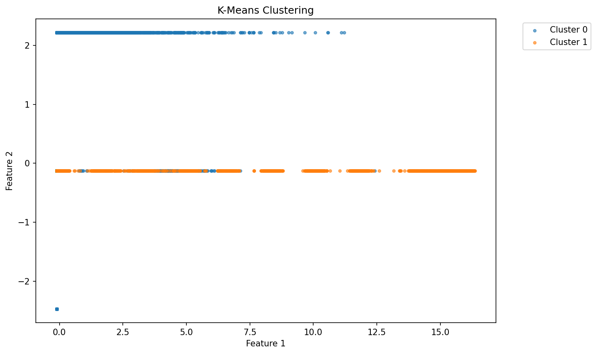

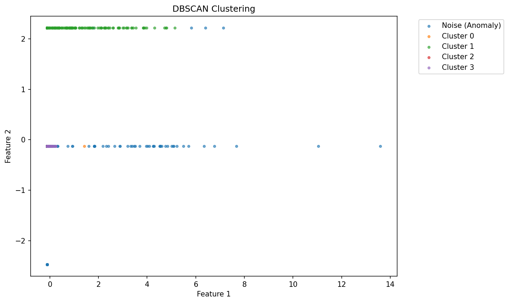

## Program 6

### Lab Program Question

Write a program to implement malware classification using feature extraction and supervised learning models such as Random Forest and SVM.

### Dataset Link

- [KDDTrain+.txt](datasets/KDDTrain+.txt)

### Program Code

File: [`week6/p6.py`](week6/p6.py)

```python
# ============================================
# WEEK 6: MALWARE CLASSIFICATION
# ============================================

import pandas as pd
import numpy as np

from sklearn.model_selection import train_test_split
from sklearn.preprocessing import LabelEncoder, StandardScaler

from sklearn.ensemble import RandomForestClassifier
from sklearn.svm import SVC

from sklearn.metrics import accuracy_score, confusion_matrix, classification_report

import seaborn as sns
import matplotlib.pyplot as plt


# ============================================
# LOAD DATA
# ============================================

def load_dataset(filepath):

    columns = [
        'duration','protocol_type','service','flag','src_bytes','dst_bytes',
        'land','wrong_fragment','urgent','hot','num_failed_logins','logged_in',
        'num_compromised','root_shell','su_attempted','num_root','num_file_creations',
        'num_shells','num_access_files','num_outbound_cmds','is_host_login',
        'is_guest_login','count','srv_count','serror_rate','srv_serror_rate',
        'rerror_rate','srv_rerror_rate','same_srv_rate','diff_srv_rate',
        'srv_diff_host_rate','dst_host_count','dst_host_srv_count',
        'dst_host_same_srv_rate','dst_host_diff_srv_rate',
        'dst_host_same_src_port_rate','dst_host_srv_diff_host_rate',
        'dst_host_serror_rate','dst_host_srv_serror_rate',
        'dst_host_rerror_rate','dst_host_srv_rerror_rate','label','difficulty'
    ]

    df = pd.read_csv(filepath, names=columns)
    print("Dataset Loaded:", df.shape)

    return df


# ============================================
# PREPROCESS
# ============================================

def preprocess(df):

    # Convert label
    df['label'] = df['label'].apply(lambda x: 0 if x == 'normal' else 1)

    # Encode categorical
    le = LabelEncoder()
    for col in ['protocol_type', 'service', 'flag']:
        df[col] = le.fit_transform(df[col])

    # Split features & target
    X = df.drop(columns=['label', 'difficulty'])
    y = df['label']

    # Scale features (important for SVM)
    scaler = StandardScaler()
    X_scaled = scaler.fit_transform(X)

    return X_scaled, y, X.columns


# ============================================
# TRAIN MODELS
# ============================================

def train_models(X_train, y_train):

    models = {
        "Random Forest": RandomForestClassifier(n_estimators=100),
        "SVM": SVC()
    }

    trained = {}

    for name, model in models.items():
        model.fit(X_train, y_train)
        trained[name] = model

    return trained


# ============================================
# EVALUATE
# ============================================

def evaluate(models, X_test, y_test):

    for name, model in models.items():

        print(f"\n===== {name} =====")

        y_pred = model.predict(X_test)

        print("Accuracy:", accuracy_score(y_test, y_pred))
        print("\nReport:\n", classification_report(y_test, y_pred))

        # Confusion Matrix
        cm = confusion_matrix(y_test, y_pred)

        plt.figure(figsize=(4,3))
        sns.heatmap(cm, annot=True, fmt='d', cmap='Blues')
        plt.title(f"{name} Confusion Matrix")
        plt.show()


# ============================================
# FEATURE IMPORTANCE (KEY PART)
# ============================================

def feature_importance(model, feature_names):

    importances = model.feature_importances_

    # Sort top features
    indices = np.argsort(importances)[-10:]

    plt.figure(figsize=(8,5))
    plt.barh(range(len(indices)), importances[indices])
    plt.yticks(range(len(indices)), [feature_names[i] for i in indices])
    plt.title("Top 10 Important Features")
    plt.xlabel("Importance")
    plt.show()


# ============================================
# MAIN
# ============================================

if __name__ == "__main__":

    df = load_dataset("../datasets/KDDTrain+.txt")

    X, y, feature_names = preprocess(df)

    X_train, X_test, y_train, y_test = train_test_split(
        X, y, test_size=0.2, random_state=42
    )

    models = train_models(X_train, y_train)

    evaluate(models, X_test, y_test)

    # Feature importance (only Random Forest)
    feature_importance(models["Random Forest"], feature_names)

    print("\n✅ Week 6 Completed Successfully!")
```

### Output

Terminal output file: [`week6/result.txt`](week6/result.txt)

```text
Program: p6.py
Working directory: D:\Desktop\msc-lab\week6
Exit code: 0
========================================================================
Dataset Loaded: (125973, 43)

===== Random Forest =====
Accuracy: 0.9989283588013494

Report:
               precision    recall  f1-score   support

           0       1.00      1.00      1.00     13422
           1       1.00      1.00      1.00     11773

    accuracy                           1.00     25195
   macro avg       1.00      1.00      1.00     25195
weighted avg       1.00      1.00      1.00     25195

[saved image] result_image_01.png

===== SVM =====
Accuracy: 0.9903155387973804

Report:
               precision    recall  f1-score   support

           0       0.99      0.99      0.99     13422
           1       0.99      0.99      0.99     11773

    accuracy                           0.99     25195
   macro avg       0.99      0.99      0.99     25195
weighted avg       0.99      0.99      0.99     25195

[saved image] result_image_02.png
[saved image] result_image_03.png

✅ Week 6 Completed Successfully!
```

### Output Images

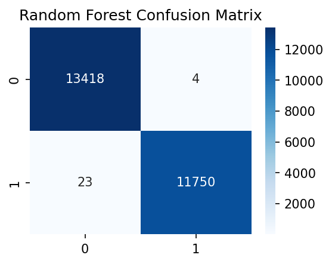

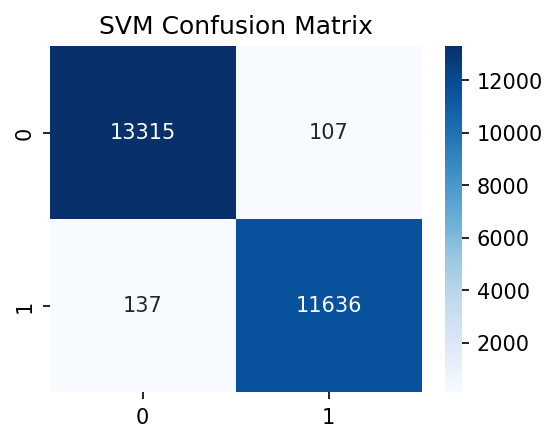

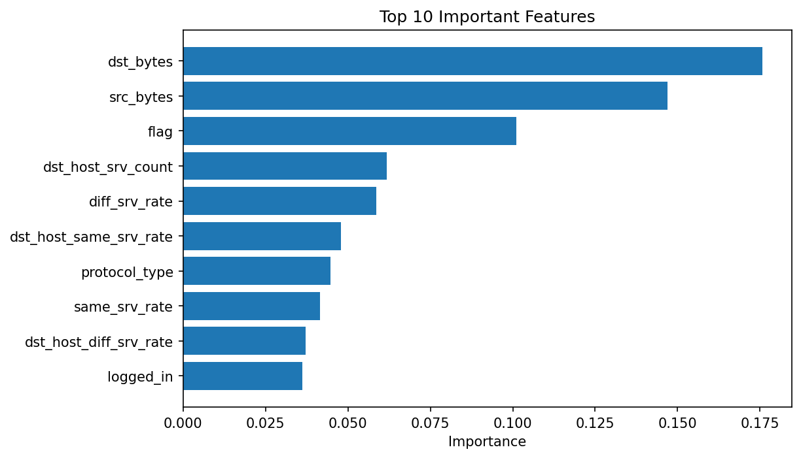

## Program 7

### Lab Program Question

Write a program to perform malware behavior analysis using unsupervised learning and dimensionality reduction techniques.

### Dataset Link

- [KDDTrain+.txt](datasets/KDDTrain+.txt)

### Program Code

File: [`week7/p7.py`](week7/p7.py)

```python
# ============================================
# WEEK 7: DIMENSIONALITY REDUCTION (PCA)
# ============================================

import pandas as pd
import numpy as np

from sklearn.preprocessing import LabelEncoder, StandardScaler
from sklearn.decomposition import PCA

import matplotlib.pyplot as plt


# ============================================
# LOAD DATA
# ============================================

def load_dataset(filepath):

    columns = [
        'duration','protocol_type','service','flag','src_bytes','dst_bytes',
        'land','wrong_fragment','urgent','hot','num_failed_logins','logged_in',
        'num_compromised','root_shell','su_attempted','num_root','num_file_creations',
        'num_shells','num_access_files','num_outbound_cmds','is_host_login',
        'is_guest_login','count','srv_count','serror_rate','srv_serror_rate',
        'rerror_rate','srv_rerror_rate','same_srv_rate','diff_srv_rate',
        'srv_diff_host_rate','dst_host_count','dst_host_srv_count',
        'dst_host_same_srv_rate','dst_host_diff_srv_rate',
        'dst_host_same_src_port_rate','dst_host_srv_diff_host_rate',
        'dst_host_serror_rate','dst_host_srv_serror_rate',
        'dst_host_rerror_rate','dst_host_srv_rerror_rate','label','difficulty'
    ]

    df = pd.read_csv(filepath, names=columns)
    print("Dataset Loaded:", df.shape)

    return df


# ============================================
# PREPROCESS
# ============================================

def preprocess(df):

    # Convert label for visualization
    df['label'] = df['label'].apply(lambda x: 0 if x == 'normal' else 1)

    # Encode categorical features
    le = LabelEncoder()
    for col in ['protocol_type', 'service', 'flag']:
        df[col] = le.fit_transform(df[col])

    # Features & labels
    X = df.drop(columns=['label', 'difficulty'])
    y = df['label']

    # Scale
    scaler = StandardScaler()
    X_scaled = scaler.fit_transform(X)

    return X_scaled, y


# ============================================
# APPLY PCA
# ============================================

def apply_pca(X):

    pca = PCA(n_components=2)
    X_pca = pca.fit_transform(X)

    print("Explained Variance:", pca.explained_variance_ratio_)

    return X_pca


# ============================================
# VISUALIZE
# ============================================

def visualize(X_pca, y):

    plt.figure(figsize=(8,6))

    # Normal
    plt.scatter(X_pca[y == 0, 0],
                X_pca[y == 0, 1],
                label="Normal",
                alpha=0.5)

    # Attack
    plt.scatter(X_pca[y == 1, 0],
                X_pca[y == 1, 1],
                label="Attack",
                alpha=0.5)

    plt.title("PCA: Malware Behavior Visualization")
    plt.xlabel("Principal Component 1")
    plt.ylabel("Principal Component 2")

    plt.legend()
    plt.show()


# ============================================
# MAIN
# ============================================

if __name__ == "__main__":

    df = load_dataset("../datasets/KDDTrain+.txt")

    X, y = preprocess(df)

    # Use subset for faster visualization
    X = X[:80000]
    y = y[:80000]

    X_pca = apply_pca(X)

    visualize(X_pca, y)

    print("\n✅ Week 7 Completed Successfully!")
```

### Output

Terminal output file: [`week7/result.txt`](week7/result.txt)

```text
Program: p7.py
Working directory: D:\Desktop\msc-lab\week7
Exit code: 0
========================================================================
Dataset Loaded: (125973, 43)
Explained Variance: [0.19517453 0.13038314]
[saved image] result_image_01.png

✅ Week 7 Completed Successfully!
```

### Output Images

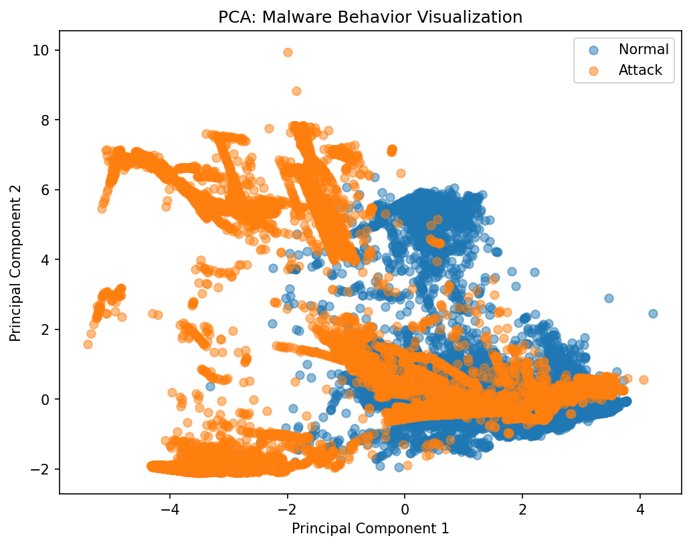

## Program 8

### Lab Program Question

Write a program to implement phishing URL detection using machine learning with lexical and content-based features.

### Dataset Link

- [dataset_full.csv](datasets/dataset_full.csv)

### Program Code

File: [`week8/p8.py`](week8/p8.py)

```python
# ============================================
# WEEK 8: PHISHING URL DETECTION
# ============================================

import pandas as pd
import numpy as np

from sklearn.model_selection import train_test_split
from sklearn.preprocessing import StandardScaler

from sklearn.linear_model import LogisticRegression
from sklearn.ensemble import RandomForestClassifier

from sklearn.metrics import accuracy_score, confusion_matrix, classification_report

import seaborn as sns
import matplotlib.pyplot as plt


# ============================================
# LOAD DATA
# ============================================

def load_data(filepath):
    df = pd.read_csv(filepath)
    print("Dataset Loaded:", df.shape)
    return df


# ============================================
# PREPROCESS
# ============================================

def preprocess(df):

    target = 'phishing'

    X = df.drop(columns=[target])
    y = df[target]

    # Convert to numeric
    X = X.apply(pd.to_numeric, errors='coerce')
    X = X.fillna(0)

    # Scale
    scaler = StandardScaler()
    X_scaled = scaler.fit_transform(X)

    return X_scaled, y, X.columns


# ============================================
# TRAIN MODELS
# ============================================

def train_models(X_train, y_train):

    models = {
        "Logistic Regression": LogisticRegression(max_iter=1000),
        "Random Forest": RandomForestClassifier(n_estimators=100)
    }

    trained = {}

    for name, model in models.items():
        model.fit(X_train, y_train)
        trained[name] = model

    return trained


# ============================================
# EVALUATE
# ============================================

def evaluate(models, X_test, y_test):

    for name, model in models.items():

        print(f"\n===== {name} =====")

        y_pred = model.predict(X_test)

        print("Accuracy:", accuracy_score(y_test, y_pred))
        print("\nReport:\n", classification_report(y_test, y_pred))

        cm = confusion_matrix(y_test, y_pred)

        plt.figure(figsize=(4,3))
        sns.heatmap(cm, annot=True, fmt='d', cmap='Blues')
        plt.title(f"{name} Confusion Matrix")
        plt.show()


# ============================================
# FEATURE IMPORTANCE
# ============================================

def feature_importance(model, feature_names):

    importances = model.feature_importances_

    # Top 10 features
    indices = np.argsort(importances)[-10:]

    plt.figure(figsize=(8,5))
    plt.barh(range(len(indices)), importances[indices])
    plt.yticks(range(len(indices)), [feature_names[i] for i in indices])
    plt.title("Top 10 Important URL Features")
    plt.xlabel("Importance")
    plt.show()


# ============================================
# MAIN
# ============================================

if __name__ == "__main__":

    df = load_data("../datasets/dataset_full.csv")

    X, y, feature_names = preprocess(df)

    X_train, X_test, y_train, y_test = train_test_split(
        X, y, test_size=0.2, random_state=42
    )

    models = train_models(X_train, y_train)

    evaluate(models, X_test, y_test)

    # Feature importance (Random Forest)
    feature_importance(models["Random Forest"], feature_names)

    print("\n✅ Week 8 Completed Successfully!")
```

### Output

Terminal output file: [`week8/result.txt`](week8/result.txt)

```text
Program: p8.py
Working directory: D:\Desktop\msc-lab\week8
Exit code: 0
========================================================================
Dataset Loaded: (88647, 112)

===== Logistic Regression =====
Accuracy: 0.9328821206993796

Report:
               precision    recall  f1-score   support

           0       0.95      0.94      0.95     11612
           1       0.89      0.91      0.90      6118

    accuracy                           0.93     17730
   macro avg       0.92      0.93      0.93     17730
weighted avg       0.93      0.93      0.93     17730

[saved image] result_image_01.png

===== Random Forest =====
Accuracy: 0.9697687535250987

Report:
               precision    recall  f1-score   support

           0       0.98      0.97      0.98     11612
           1       0.95      0.96      0.96      6118

    accuracy                           0.97     17730
   macro avg       0.97      0.97      0.97     17730
weighted avg       0.97      0.97      0.97     17730

[saved image] result_image_02.png
[saved image] result_image_03.png

✅ Week 8 Completed Successfully!
```

### Output Images

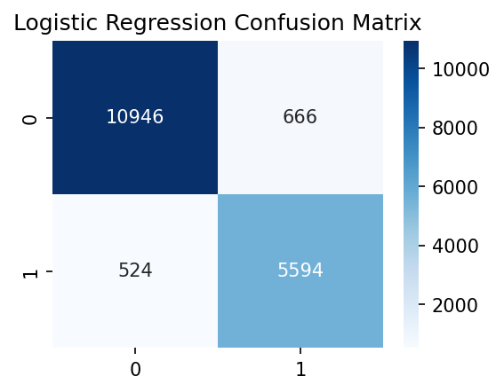

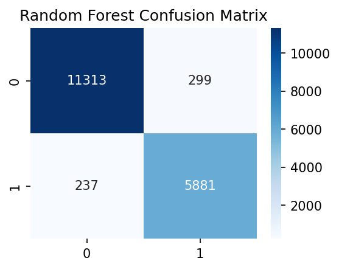

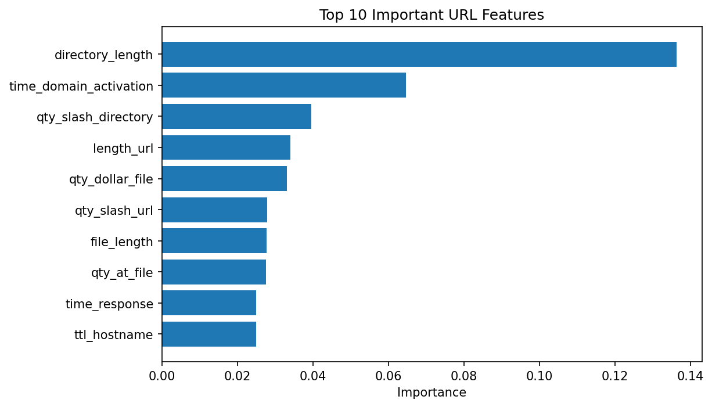

## Program 9

### Lab Program Question

Write a program to simulate adversarial attacks on machine learning models and demonstrate model robustness evaluation.

### Dataset Link

- [KDDTrain+.txt](datasets/KDDTrain+.txt)

### Program Code

File: [`week9/p9.py`](week9/p9.py)

```python
# ============================================
# WEEK 9: ADVERSARIAL ATTACK SIMULATION
# ============================================

import pandas as pd
import numpy as np

from sklearn.model_selection import train_test_split
from sklearn.preprocessing import LabelEncoder, StandardScaler
from sklearn.tree import DecisionTreeClassifier
from sklearn.metrics import accuracy_score

import matplotlib.pyplot as plt


# ============================================
# LOAD DATA
# ============================================

def load_dataset(filepath):

    columns = [
        'duration','protocol_type','service','flag','src_bytes','dst_bytes',
        'land','wrong_fragment','urgent','hot','num_failed_logins','logged_in',
        'num_compromised','root_shell','su_attempted','num_root','num_file_creations',
        'num_shells','num_access_files','num_outbound_cmds','is_host_login',
        'is_guest_login','count','srv_count','serror_rate','srv_serror_rate',
        'rerror_rate','srv_rerror_rate','same_srv_rate','diff_srv_rate',
        'srv_diff_host_rate','dst_host_count','dst_host_srv_count',
        'dst_host_same_srv_rate','dst_host_diff_srv_rate',
        'dst_host_same_src_port_rate','dst_host_srv_diff_host_rate',
        'dst_host_serror_rate','dst_host_srv_serror_rate',
        'dst_host_rerror_rate','dst_host_srv_rerror_rate','label','difficulty'
    ]

    df = pd.read_csv(filepath, names=columns)
    print("Dataset Loaded:", df.shape)

    return df


# ============================================
# PREPROCESS
# ============================================

def preprocess(df):

    df['label'] = df['label'].apply(lambda x: 0 if x == 'normal' else 1)

    le = LabelEncoder()
    for col in ['protocol_type', 'service', 'flag']:
        df[col] = le.fit_transform(df[col])

    X = df.drop(columns=['label', 'difficulty'])
    y = df['label']

    scaler = StandardScaler()
    X_scaled = scaler.fit_transform(X)

    return X_scaled, y


# ============================================
# TRAIN MODEL
# ============================================

def train_model(X_train, y_train):

    model = DecisionTreeClassifier()
    model.fit(X_train, y_train)

    return model


# ============================================
# ADVERSARIAL ATTACK (ADD NOISE)
# ============================================

def add_noise(X, epsilon=0.1):

    noise = epsilon * np.random.normal(size=X.shape)
    X_adv = X + noise

    return X_adv


# ============================================
# MAIN
# ============================================

if __name__ == "__main__":

    df = load_dataset("../datasets/KDDTrain+.txt")

    X, y = preprocess(df)

    X_train, X_test, y_train, y_test = train_test_split(
        X, y, test_size=0.2, random_state=42
    )

    # Train model
    model = train_model(X_train, y_train)

    # Original accuracy
    y_pred = model.predict(X_test)
    acc_original = accuracy_score(y_test, y_pred)

    print("\nOriginal Accuracy:", acc_original)

    # Apply adversarial attack
    X_test_adv = add_noise(X_test, epsilon=0.2)

    # Accuracy after attack
    y_pred_adv = model.predict(X_test_adv)
    acc_adv = accuracy_score(y_test, y_pred_adv)

    print("Accuracy After Attack:", acc_adv)

    print("\nAccuracy Drop:", acc_original - acc_adv)

    print("\n✅ Week 9 Completed Successfully!")
```

### Output

Terminal output file: [`week9/result.txt`](week9/result.txt)

```text
Program: p9.py
Working directory: D:\Desktop\msc-lab\week9
Exit code: 0
========================================================================
Dataset Loaded: (125973, 43)

Original Accuracy: 0.9979757888469935
Accuracy After Attack: 0.6881921016074618

Accuracy Drop: 0.30978368723953165

✅ Week 9 Completed Successfully!
```

### Output Images

No image output was generated for this program.

## Program 10

### Lab Program Question

Write a program to analyze network traffic captures (PCAP files) and extract features for botnet detection using classification or clustering methods.

### Dataset Link

- [capture20110810.binetflow](datasets/capture20110810.binetflow)

### Program Code

File: [`week10/p10.py`](week10/p10.py)

```python
# ============================================
# WEEK 10: PCAP / BINETFLOW ANALYSIS
# ============================================

import pandas as pd
import numpy as np

from sklearn.preprocessing import LabelEncoder, StandardScaler
from sklearn.cluster import KMeans

import matplotlib.pyplot as plt


# ============================================
# LOAD DATA
# ============================================

def load_data(filepath):

    df = pd.read_csv(filepath)

    print("Dataset Loaded:", df.shape)
    print("\nColumns:\n", df.columns)

    return df


# ============================================
# PREPROCESS
# ============================================

def preprocess(df):

    # Drop non-useful columns if present
    drop_cols = ['StartTime', 'SrcAddr', 'DstAddr']
    for col in drop_cols:
        if col in df.columns:
            df = df.drop(columns=[col])

    # Handle categorical columns
    df = df.apply(LabelEncoder().fit_transform)

    # Separate features
    X = df.values

    # Scale
    scaler = StandardScaler()
    X_scaled = scaler.fit_transform(X)

    return X_scaled


# ============================================
# CLUSTERING (BOTNET DETECTION)
# ============================================

def detect_botnet(X):

    kmeans = KMeans(n_clusters=2, random_state=42)
    labels = kmeans.fit_predict(X)

    print("\nClustering Done!")

    return labels


# ============================================
# VISUALIZE
# ============================================

def visualize(X, labels):

    plt.figure(figsize=(10,6))

    unique_labels = np.unique(labels)

    for label in unique_labels:

        cluster_points = X[labels == label]

        # Assign meaningful names
        if label == 0:
            name = "Normal Traffic"
        else:
            name = "Suspicious / Botnet"

        plt.scatter(cluster_points[:, 0], cluster_points[:, 1],
                    label=name,
                    alpha=0.5,
                    s=10)

    plt.title("Botnet Detection (Clustering)")
    plt.xlabel("Feature 1")
    plt.ylabel("Feature 2")

    # Move legend outside (important)
    plt.legend(bbox_to_anchor=(1.05, 1), loc='upper left')

    plt.tight_layout()
    plt.show()


# ============================================
# MAIN
# ============================================

if __name__ == "__main__":

    df = load_data("../datasets/capture20110810.binetflow")

    X = preprocess(df)

    # Use subset (important)
    X = X[:5000]

    labels = detect_botnet(X)

    visualize(X, labels)

    print("\n✅ Week 10 Completed Successfully!")
```

### Output

Terminal output file: [`week10/result.txt`](week10/result.txt)

```text
Program: p10.py
Working directory: D:\Desktop\msc-lab\week10
Exit code: 0
========================================================================
Dataset Loaded: (254245, 15)

Columns:
 Index(['StartTime', 'Dur', 'Proto', 'SrcAddr', 'Sport', 'Dir', 'DstAddr',
       'Dport', 'State', 'sTos', 'dTos', 'TotPkts', 'TotBytes', 'SrcBytes',
       'Label'],
      dtype='str')

Clustering Done!
[saved image] result_image_01.png

✅ Week 10 Completed Successfully!
```

### Output Images

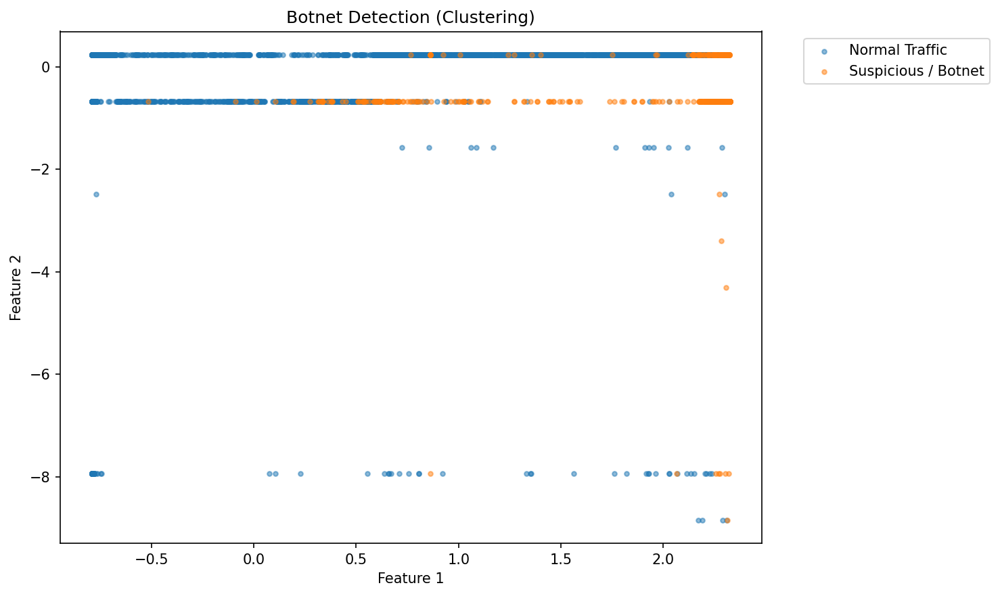

## Program 11

### Lab Program Question

Write a program to design a predictive model to detect brute-force or penetration attack attempts from log or network data.

### Dataset Link

- [auth.log](datasets/auth.log)

### Program Code

File: [`week11/p11.py`](week11/p11.py)

```python
# ============================================
# WEEK 11: BRUTE FORCE DETECTION (FIXED)
# ============================================

import pandas as pd
import re
import matplotlib.pyplot as plt


# ============================================
# LOAD & PARSE LOG FILE
# ============================================

def load_logs(filepath):

    data = []

    with open(filepath, 'r') as f:
        for line in f:

            # Extract IP
            ip_match = re.findall(r'\d+\.\d+\.\d+\.\d+', line)

            if not ip_match:
                continue

            ip = ip_match[0]

            # Extract timestamp (simple format)
            timestamp_match = re.search(r'^\w+\s+\d+\s+\d+:\d+:\d+', line)

            timestamp = timestamp_match.group(0) if timestamp_match else None

            # Case 1: Multiple failures in one line
            multi_fail = re.search(r'(\d+) more authentication failures', line)

            if multi_fail:
                count = int(multi_fail.group(1))
                success = 0

                for _ in range(count):
                    data.append([ip, timestamp, success])

            # Case 2: Single failed password
            elif "Failed password" in line:
                success = 0
                data.append([ip, timestamp, success])

            # Case 3: Successful login
            elif "Accepted" in line:
                success = 1
                data.append([ip, timestamp, success])

    df = pd.DataFrame(data, columns=['ip', 'timestamp', 'success'])

    print("Logs Loaded:", df.shape)

    return df


# ============================================
# DETECT BRUTE FORCE
# ============================================

def detect_bruteforce(df):

    # Count failed attempts per IP
    failed = df[df['success'] == 0]

    attack_counts = failed.groupby('ip').size()

    # Threshold
    threshold = 5

    attackers = attack_counts[attack_counts > threshold]

    print("\n⚠️ Suspicious IPs (Brute Force):")
    print(attackers)

    return attackers


# ============================================
# VISUALIZATION
# ============================================

def visualize(attackers, top_n=10):

    if len(attackers) == 0:
        print("No brute force attacks detected.")
        return

    # Take top N attackers
    attackers = attackers.sort_values(ascending=False).head(top_n)

    plt.figure(figsize=(10,5))

    attackers.plot(kind='bar')

    plt.title(f"Top {top_n} Brute Force Attackers")
    plt.xlabel("IP Address")
    plt.ylabel("Failed Attempts")

    plt.xticks(rotation=45, fontsize=8)  # cleaner labels
    plt.tight_layout()

    plt.show()

# ============================================
# MAIN
# ============================================

if __name__ == "__main__":

    df = load_logs("../datasets/auth.log")

    attackers = detect_bruteforce(df)

    visualize(attackers)

    print("\n✅ Week 11 Completed Successfully!")
```

### Output

Terminal output file: [`week11/result.txt`](week11/result.txt)

```text
Program: p11.py
Working directory: D:\Desktop\msc-lab\week11
Exit code: 0
========================================================================
Logs Loaded: (1624, 3)

⚠️ Suspicious IPs (Brute Force):
ip
1.189.205.173      7
1.30.211.144      11
103.230.120.26    11
105.101.221.33    11
106.57.58.19       7
                  ..
85.245.107.41     11
91.243.236.123     7
93.120.176.237    11
94.154.25.149      7
95.190.198.34      7
Length: 102, dtype: int64
[saved image] result_image_01.png

✅ Week 11 Completed Successfully!
```

### Output Images

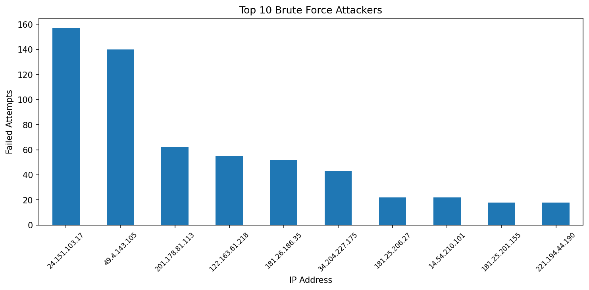

## Program 12

### Lab Program Question

Write a program to build and test a hybrid intrusion detection system combining supervised and unsupervised approaches for adaptive security.

### Dataset Link

- [KDDTrain+.txt](datasets/KDDTrain+.txt)

### Program Code

File: [`week12/p12.py`](week12/p12.py)

```python
# ============================================
# WEEK 12: HYBRID IDS (SUPERVISED + UNSUPERVISED)
# ============================================

import pandas as pd
import numpy as np

from sklearn.model_selection import train_test_split
from sklearn.preprocessing import LabelEncoder, StandardScaler

from sklearn.tree import DecisionTreeClassifier
from sklearn.ensemble import IsolationForest

from sklearn.metrics import accuracy_score


# ============================================
# LOAD DATA
# ============================================

def load_dataset(filepath):

    columns = [
        'duration','protocol_type','service','flag','src_bytes','dst_bytes',
        'land','wrong_fragment','urgent','hot','num_failed_logins','logged_in',
        'num_compromised','root_shell','su_attempted','num_root','num_file_creations',
        'num_shells','num_access_files','num_outbound_cmds','is_host_login',
        'is_guest_login','count','srv_count','serror_rate','srv_serror_rate',
        'rerror_rate','srv_rerror_rate','same_srv_rate','diff_srv_rate',
        'srv_diff_host_rate','dst_host_count','dst_host_srv_count',
        'dst_host_same_srv_rate','dst_host_diff_srv_rate',
        'dst_host_same_src_port_rate','dst_host_srv_diff_host_rate',
        'dst_host_serror_rate','dst_host_srv_serror_rate',
        'dst_host_rerror_rate','dst_host_srv_rerror_rate','label','difficulty'
    ]

    df = pd.read_csv(filepath, names=columns)
    print("Dataset Loaded:", df.shape)

    return df


# ============================================
# PREPROCESS
# ============================================

def preprocess(df):

    # Convert label
    df['label'] = df['label'].apply(lambda x: 0 if x == 'normal' else 1)

    # Encode categorical
    le = LabelEncoder()
    for col in ['protocol_type', 'service', 'flag']:
        df[col] = le.fit_transform(df[col])

    X = df.drop(columns=['label', 'difficulty'])
    y = df['label']

    # Scale
    scaler = StandardScaler()
    X_scaled = scaler.fit_transform(X)

    return X_scaled, y


# ============================================
# SUPERVISED MODEL
# ============================================

def train_supervised(X_train, y_train):

    model = DecisionTreeClassifier()
    model.fit(X_train, y_train)

    return model


# ============================================
# UNSUPERVISED MODEL
# ============================================

def train_unsupervised(X_train):

    model = IsolationForest(contamination=0.1, random_state=42)
    model.fit(X_train)

    return model


# ============================================
# HYBRID DETECTION
# ============================================

def hybrid_detection(supervised_model, unsupervised_model, X_test):

    # Supervised prediction
    y_super = supervised_model.predict(X_test)

    # Unsupervised prediction (-1 anomaly, 1 normal)
    y_unsuper = unsupervised_model.predict(X_test)

    # Convert to 0/1
    y_unsuper = np.where(y_unsuper == -1, 1, 0)

    # Hybrid: if either detects attack → attack
    y_final = np.where((y_super == 1) | (y_unsuper == 1), 1, 0)

    return y_super, y_unsuper, y_final


# ============================================
# EVALUATION
# ============================================

def evaluate(y_test, y_super, y_unsuper, y_final):

    print("\nSupervised Accuracy:", accuracy_score(y_test, y_super))
    print("Unsupervised Approx Accuracy:", accuracy_score(y_test, y_unsuper))
    print("Hybrid Accuracy:", accuracy_score(y_test, y_final))


# ============================================
# MAIN
# ============================================

if __name__ == "__main__":

    df = load_dataset("../datasets/KDDTrain+.txt")

    X, y = preprocess(df)

    X_train, X_test, y_train, y_test = train_test_split(
        X, y, test_size=0.2, random_state=42
    )

    # Train models
    supervised_model = train_supervised(X_train, y_train)
    unsupervised_model = train_unsupervised(X_train)

    # Hybrid prediction
    y_super, y_unsuper, y_final = hybrid_detection(
        supervised_model, unsupervised_model, X_test
    )

    # Evaluate
    evaluate(y_test, y_super, y_unsuper, y_final)

    print("\n✅ Week 12 Completed Successfully!")
```

### Output

Terminal output file: [`week12/result.txt`](week12/result.txt)

```text
Program: p12.py
Working directory: D:\Desktop\msc-lab\week12
Exit code: 0
========================================================================
Dataset Loaded: (125973, 43)

Supervised Accuracy: 0.9978567176026989
Unsupervised Approx Accuracy: 0.565985314546537
Hybrid Accuracy: 0.9645961500297678

✅ Week 12 Completed Successfully!
```

### Output Images

No image output was generated for this program.

## Program 13

### Lab Program Question

Write a program to implement feature engineering and model explainability techniques such as SHAP or LIME for AI-driven cyber threat detection systems.

### Dataset Link

- [KDDTrain+.txt](datasets/KDDTrain+.txt)

### Program Code

File: [`week13/p13.py`](week13/p13.py)

```python
# ============================================
# WEEK 13: EXPLAINABLE AI (SHAP)
# ============================================

import pandas as pd
import numpy as np

from sklearn.model_selection import train_test_split
from sklearn.preprocessing import LabelEncoder, StandardScaler
from sklearn.ensemble import RandomForestClassifier

import shap
import matplotlib.pyplot as plt


# ============================================
# LOAD DATA
# ============================================

def load_dataset(filepath):

    columns = [
        'duration','protocol_type','service','flag','src_bytes','dst_bytes',
        'land','wrong_fragment','urgent','hot','num_failed_logins','logged_in',
        'num_compromised','root_shell','su_attempted','num_root','num_file_creations',
        'num_shells','num_access_files','num_outbound_cmds','is_host_login',
        'is_guest_login','count','srv_count','serror_rate','srv_serror_rate',
        'rerror_rate','srv_rerror_rate','same_srv_rate','diff_srv_rate',
        'srv_diff_host_rate','dst_host_count','dst_host_srv_count',
        'dst_host_same_srv_rate','dst_host_diff_srv_rate',
        'dst_host_same_src_port_rate','dst_host_srv_diff_host_rate',
        'dst_host_serror_rate','dst_host_srv_serror_rate',
        'dst_host_rerror_rate','dst_host_srv_rerror_rate','label','difficulty'
    ]

    df = pd.read_csv(filepath, names=columns)
    print("Dataset Loaded:", df.shape)

    return df


# ============================================
# PREPROCESS
# ============================================

def preprocess(df):

    df['label'] = df['label'].apply(lambda x: 0 if x == 'normal' else 1)

    le = LabelEncoder()
    for col in ['protocol_type', 'service', 'flag']:
        df[col] = le.fit_transform(df[col])

    X = df.drop(columns=['label', 'difficulty'])
    y = df['label']

    scaler = StandardScaler()
    X_scaled = scaler.fit_transform(X)

    return X_scaled, y, X.columns


# ============================================
# TRAIN MODEL
# ============================================

def train_model(X_train, y_train):

    model = RandomForestClassifier(n_estimators=100)
    model.fit(X_train, y_train)

    return model


# ============================================
# SHAP EXPLANATION
# ============================================
def explain(model, X_sample, feature_names):

    explainer = shap.TreeExplainer(model)

    shap_values = explainer.shap_values(X_sample)

    # Handle both formats
    if isinstance(shap_values, list):
        shap_values_to_use = shap_values[1]
    else:
        shap_values_to_use = shap_values

    # 🔥 1. Summary Plot (MOST IMPORTANT)
    shap.summary_plot(shap_values_to_use, X_sample, feature_names=feature_names)

    # 🔥 2. Feature Importance Bar Plot (VERY SAFE)
    shap.summary_plot(shap_values_to_use, X_sample,
                      feature_names=feature_names,
                      plot_type="bar")


# ============================================
# MAIN
# ============================================

if __name__ == "__main__":

    df = load_dataset("../datasets/KDDTrain+.txt")

    X, y, feature_names = preprocess(df)

    # Use subset (important for SHAP speed)
    X = X[:2000]
    y = y[:2000]

    X_train, X_test, y_train, y_test = train_test_split(
        X, y, test_size=0.2, random_state=42
    )

    model = train_model(X_train, y_train)
    X_test = np.array(X_test)
    # Explain predictions
    explain(model, X_test[:100], feature_names)

    print("\n✅ Week 13 Completed Successfully!")
```

### Output

Terminal output file: [`week13/result.txt`](week13/result.txt)

```text
Program: p13.py
Working directory: D:\Desktop\msc-lab\week13
Exit code: 0
========================================================================
Dataset Loaded: (125973, 43)
[saved image] result_image_01.png
[saved image] result_image_02.png

✅ Week 13 Completed Successfully!
```

### Output Images


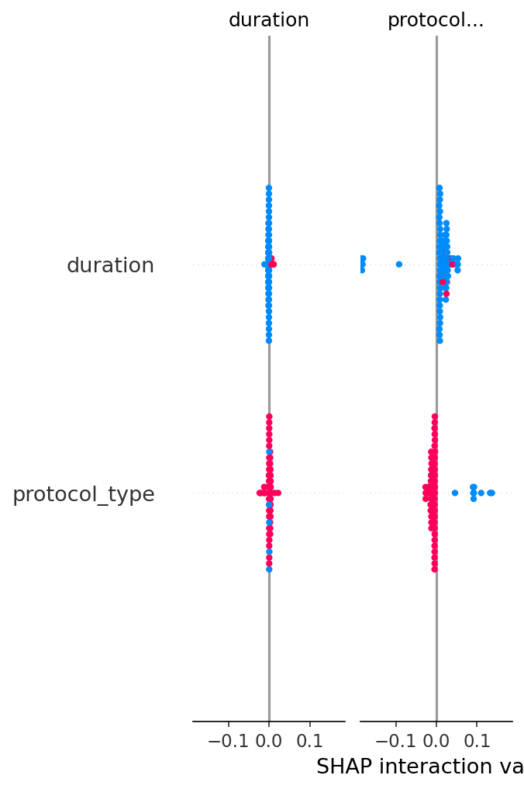

